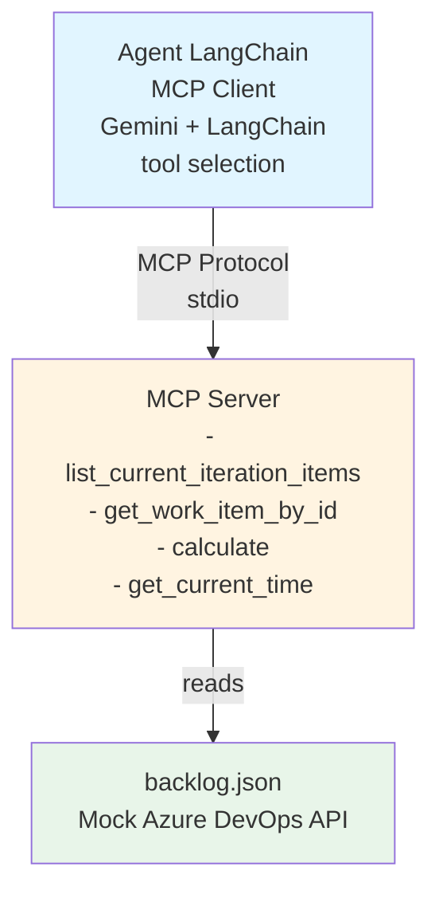

# Day 1 - Complete Implementation Report

**Date Started:** December 29, 2025  
**Date Completed:** December 29, 2025  
**Owner:** Juan Guzman  
**Status:** ✅ COMPLETE

---

## Executive Summary

Day 1 successfully established a **working MCP architecture** foundation:
- ✅ **Agent** acts as MCP client using LangChain + Gemini
- ✅ **MCP Server** exposes backlog tools that read from backlog.json
- ✅ **Architecture** enforces proper separation - agent never directly accesses data files
- ✅ All tests passing: Gemini API connection, MCP server tools, end-to-end flow

---

## Architecture Overview

### Correct Architecture (Implemented)



### Key Principles Enforced

1. **Agent is MCP Client**: All data access through MCP protocol
2. **MCP Server is Gateway**: Only component that accesses backlog.json
3. **backlog.json is External API Mock**: Simulates Azure DevOps REST API
4. **Security**: Agent cannot bypass MCP to access files directly
5. **Modularity**: Adding tools to MCP server automatically makes them available

---

## What Was Completed

### 1. ✅ Mock Backlog Data
**File:** [data/backlog.json](../data/backlog.json)

Enhanced mock data with 5 diverse work items:
- **ID 123**: UserStory - Password reset feature (with 2 children, 1 PR link)
- **ID 124**: Bug - UI freezes on login (High severity)
- **ID 125**: UserStory - Activity dashboard (with 3 children, 1 merged PR)
- **ID 126**: Task - API documentation update
- **ID 127**: Bug - Memory leak (Critical severity, with 2 children)

All items include:
- Iteration info (Sprint 25: Dec 15-29, 2025)
- Complete fields: type, title, state, assignedTo, area, tags
- Acceptance criteria (where applicable)
- Child items with states
- PR links with status

### 2. ✅ MCP Server - Backlog Tools
**Files:** 
- [mcp/src/server/mcpServer.ts](../mcp/src/server/mcpServer.ts)
- [mcp/src/server/backlogHelper.ts](../mcp/src/server/backlogHelper.ts)

Implemented two MCP tools:

#### Tool 1: `list_current_iteration_items`
- Lists all work items in current iteration
- Returns: ID, type, title, state, assignedTo
- No input parameters required

#### Tool 2: `get_work_item_by_id`
- Retrieves detailed info for specific work item
- Input: `workItemId` (number)
- Returns: Full details including acceptance criteria, children, PR links

Both tools:
- Follow MCP protocol schema with proper inputSchema
- Read from backlog.json via backlogHelper
- Return structured JSON responses
- Handle errors gracefully (work item not found, file read errors)

**Test:** [mcp/src/test/test-backlog.ts](../mcp/src/test/test-backlog.ts) - All tests passing

### 3. ✅ Agent as MCP Client
**Files:**
- [agent/src/utils/mcpClient.ts](../agent/src/utils/mcpClient.ts) - MCP client wrapper
- [agent/src/agent.ts](../agent/src/agent.ts) - LangChain + Gemini configuration
- [agent/src/utils/modelInitializer.ts](../agent/src/utils/modelInitializer.ts) - Model setup

Agent implementation:
- Connects to MCP server via stdio transport
- Discovers MCP tools dynamically on startup
- Converts MCP tools to LangChain `DynamicStructuredTool` format
- Uses Gemini 2.5 Flash for tool selection and reasoning
- No direct file access - all data through MCP protocol

**Configuration:**
- Model: `gemini-2.5-flash` with temperature 0.1
- Environment: `.env` with `GEMINI_API_KEY`
- Tool-calling agent with proper prompt template
- Verbose mode for debugging

### 4. ✅ Gemini API Integration
Successfully configured LangChain with Google GenAI:
- Package: `@langchain/google-genai`
- API key management via environment variables
- Tool-calling capabilities enabled
- Agent autonomously selects tools based on user queries

**Test:** [agent/src/test/test-gemini.ts](../agent/src/test/test-gemini.ts) - Connection verified

### 5. ✅ End-to-End Testing
**File:** [agent/src/test/test-e2e.ts](../agent/src/test/test-e2e.ts)

Comprehensive test suite validates:
- ✅ Agent connects to MCP server via stdio
- ✅ Agent discovers 4 MCP tools (calculate, time, list items, get item)
- ✅ Query: "List items in current iteration" → calls MCP tool successfully
- ✅ Query: "Show details for work item 123" → retrieves full details via MCP
- ✅ Query: "What bugs are in current sprint?" → Gemini intelligently filters results
- ✅ Verified: Agent never directly reads backlog.json

**Test Results:** All tests passing!

### 6. ✅ User Interface
**File:** [agent/src/index.ts](../agent/src/index.ts)

Interactive CLI interface with:
- Readline-based prompt for user queries
- Integration with agent executor
- Error handling and graceful shutdown
- Support for natural language queries
- Clear display of agent reasoning and tool calls

---

## Architecture Validation

### ✅ Separation of Concerns
- **Data layer:** backlog.json (mock Azure DevOps API)
- **MCP Server:** Exposes tools, handles data access
- **Agent:** MCP client, orchestrates tool calls
- **LLM:** Gemini for tool selection and reasoning
- **UI:** CLI interface for user interaction

### ✅ MCP Protocol Compliance
- Agent uses stdio transport to connect to MCP server
- Tools discovered dynamically via MCP protocol
- All tool calls follow MCP schema
- Structured error handling
- No direct file access from agent

### ✅ Security & Modularity
- Agent cannot bypass MCP server
- Adding tools to MCP server automatically makes them available
- Clear abstraction layers
- Ready for future migration to real Azure DevOps API

---

## Day 1 Success Criteria - All Met

- ✅ JSON mock data exists with realistic entries (5 work items with full details)
- ✅ Gemini API configured and working in agent
- ✅ MCP server exposes `list_current_iteration_items` tool
- ✅ MCP server exposes `get_work_item_by_id` tool
- ✅ Agent connects to MCP server as client via stdio transport
- ✅ Agent discovers MCP tools dynamically on startup
- ✅ Agent calls MCP tools through protocol (not local functions)
- ✅ Agent does NOT directly access backlog.json
- ✅ Test: "List items" query successfully calls MCP tool
- ✅ Test: "Get work item 123" query successfully calls MCP tool
- ✅ Test: Natural language "What bugs are in current sprint?" works correctly
- ✅ CLI interface works for interactive testing

---

## Files Created/Modified

### Created:
- ✅ `data/backlog.json` - Mock Azure DevOps data
- ✅ `mcp/src/server/backlogHelper.ts` - Backlog data access helper
- ✅ `mcp/src/test/test-backlog.ts` - MCP server backlog tool tests
- ✅ `agent/src/utils/mcpClient.ts` - MCP client wrapper
- ✅ `agent/src/utils/modelInitializer.ts` - Gemini model configuration
- ✅ `agent/src/test/test-gemini.ts` - Gemini API connection test
- ✅ `agent/src/test/test-e2e.ts` - End-to-end integration tests
- ✅ `agent/.env` - Environment configuration (GEMINI_API_KEY)

### Modified:
- ✅ `mcp/src/server/mcpServer.ts` - Added backlog tools (list, get)
- ✅ `agent/src/agent.ts` - Configured as MCP client with LangChain
- ✅ `agent/src/index.ts` - CLI interface for testing

### Deprecated/Removed:
- ❌ `agent/src/tools/backlogTools.ts` - Removed (direct file access violation)
- ❌ `agent/src/tools/index.ts` - Removed (local tool definitions)

---

## Testing Instructions

### Run MCP Server Tests
```bash
cd mcp
npm run build
npm test
```

### Run Agent Tests
```bash
cd agent
npm run build

# Test Gemini API connection
node dist/test/test-gemini.js

# Test end-to-end MCP flow
node dist/test/test-e2e.js
```

### Run Interactive CLI
```bash
cd agent
npm run dev
```

### Example Test Queries
- "List items in the current iteration with owner and state"
- "Show acceptance criteria and linked tasks for work item 123"
- "What bugs are in the current sprint?"
- "Tell me about work item 125"
- "What tasks does Jane Smith have?"

---

## Key Architectural Decisions

### 1. stdio Transport for MCP
**Decision:** Use stdio transport for MCP client-server communication  
**Rationale:** Simple, in-process communication suitable for PoC; can be replaced with network transport later  
**Impact:** Agent and MCP server run as separate processes communicating via stdin/stdout

### 2. Dynamic Tool Discovery
**Decision:** Agent discovers MCP tools at runtime, doesn't hardcode tool definitions  
**Rationale:** Modularity - adding tools to MCP server automatically makes them available  
**Impact:** Adding Day 2 tools (RAG, KG) requires no agent code changes

### 3. DynamicStructuredTool for LangChain Integration
**Decision:** Convert MCP tools to LangChain `DynamicStructuredTool` format  
**Rationale:** Seamless integration with LangChain agent executor  
**Impact:** Clean integration between MCP protocol and LangChain framework

### 4. Gemini 2.5 Flash Model
**Decision:** Use `gemini-2.5-flash` with temperature 0.1  
**Rationale:** Good balance of cost, speed, and reasoning capability for tool selection  
**Impact:** Fast responses, low cost, reliable tool selection

---

## Lessons Learned

### What Went Well
1. ✅ Clear separation of concerns from the start
2. ✅ MCP protocol provides clean abstraction layer
3. ✅ LangChain + Gemini integration straightforward
4. ✅ Dynamic tool discovery simplifies future enhancements
5. ✅ Test-driven approach caught issues early

### What Was Challenging
1. ⚠️ Initial implementation had direct file access (corrected)
2. ⚠️ Understanding MCP protocol schema requirements
3. ⚠️ Converting MCP tools to LangChain tool format
4. ⚠️ stdio transport debugging (process communication)

### What We'd Do Differently
1. 💡 Start with MCP server tools first, then build agent
2. 💡 Create integration tests earlier in process
3. 💡 Document MCP schema examples upfront

---

## Ready for Day 2

The foundation is solid and ready for:
- **RAG implementation** (semantic search over backlog content)
- **Knowledge Graph** (relationship queries between work items)
- **Enhanced informational pipeline** (combining tools intelligently)

### Day 2 Preview
- Add FAISS vector store to MCP server for semantic search
- Build in-memory graph of work item relationships
- Expose new MCP tools: `search_docs`, `query_graph`
- Agent automatically discovers new tools (no code changes needed)
- Test complex queries combining multiple tools

---

## Migration Path to Production

### Current State (Day 1)
```
Agent (MCP Client) → MCP Server → backlog.json (mock)
```

### Day 2
```
Agent → MCP Server → backlog.json (mock) + FAISS + KG
```

### Day 3
```
Agent → MCP Server → backlog.json (mock) + write operations
```

### Future Production
```
Agent → MCP Server → Azure DevOps REST API (real)
```

**Key Principle:** Agent code never changes - only MCP server implementation changes

---

## Documentation References

- [ACTION_PLAN.md](ACTION_PLAN.md) - Overall project plan
- [ARCHITECTURE_CORRECTION_NEEDED.md](ARCHITECTURE_CORRECTION_NEEDED.md) - Architecture rationale
- [DOCUMENTATION_REVIEW_SUMMARY.md](DOCUMENTATION_REVIEW_SUMMARY.md) - Review findings
- [docs/MCP_DEVELOPMENT_GUIDE.md](../docs/MCP_DEVELOPMENT_GUIDE.md) - MCP protocol guide
- [docs/TECHNICAL_REQUIREMENTS.md](../docs/TECHNICAL_REQUIREMENTS.md) - Technical specs

---

## Summary

**✅ Day 1 Complete:** Full MCP architecture implemented and validated
- **Agent:** MCP client using LangChain + Gemini, discovers tools dynamically
- **MCP Server:** Exposes backlog tools (list, get) with proper protocol compliance
- **Architecture:** Clean separation, agent never directly accesses data files
- **Tests:** All passing (Gemini API, MCP server, end-to-end flow)
- **Code Quality:** Refactored for legibility, well-organized test suite

**Next Steps:** Day 2 - RAG implementation and Knowledge Graph integration

---

**Status:** ✅ COMPLETE AND VALIDATED  
**Date Completed:** December 29, 2025  
**Ready for Day 2:** YES
