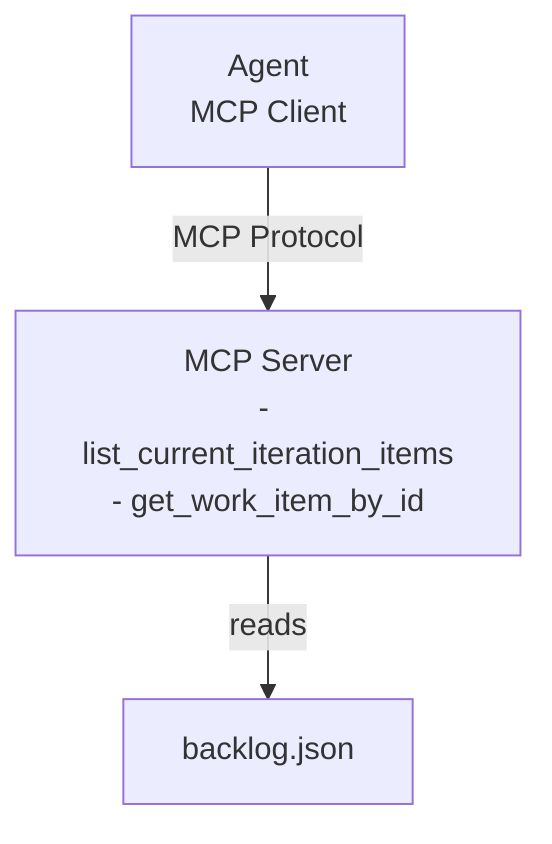
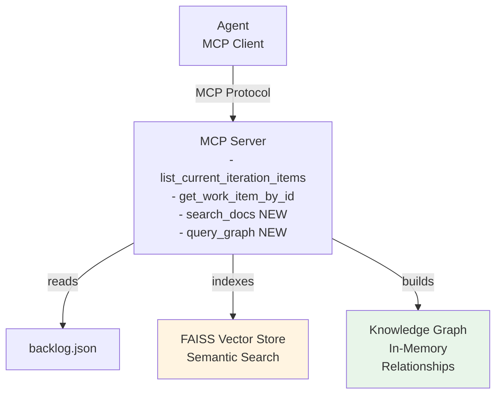

# Day 2 — RAG + Knowledge Graph Implementation

**Date:** December 30, 2025  
**Owner:** Juan Guzman  
**Status:** 📋 PLANNED

---

## Goal

Enhance the MCP server with **semantic search (RAG)** and **structural queries (Knowledge Graph)** to enable more sophisticated informational queries without changing agent code.

---

## Architecture Overview

### Day 1 vs Day 2 Architecture

#### Current (Day 1)


#### Target (Day 2)


---

## What Will Be Added

### 1. RAG (Retrieval Augmented Generation)
**Purpose:** Semantic search over work item content

**Implementation:**
- Vector store: FAISS (local, in-memory)
- Embeddings: OpenAI or Google embeddings
- Source data: backlog.json (descriptions, acceptance criteria, comments)
- Exposed as: MCP tool `search_docs`

**Example Queries:**
- "Find items related to authentication"
- "What work involves database optimization?"
- "Search for items mentioning API endpoints"

### 2. Knowledge Graph
**Purpose:** Structural queries about work item relationships

**Implementation:**
- In-memory graph structure
- Nodes: Work items (UserStory, Task, Bug)
- Edges: Parent-child, related items, PR links
- Query capabilities: Relationships, dependencies, area, iteration
- Exposed as: MCP tool `query_graph`

**Example Queries:**
- "What are all child tasks of US-123?"
- "Which items are blocked?"
- "Show me the dependency tree for this feature"
- "What items are assigned to Team Alpha?"

---

## Implementation Tasks

### Task 1: Add RAG to MCP Server

#### 1.1 Install Dependencies
```bash
cd mcp
npm install @langchain/community faiss-node @langchain/openai
# OR use Google embeddings if preferred
npm install @langchain/google-genai
```

#### 1.2 Create RAG Helper
**File:** `mcp/src/server/ragHelper.ts`

```typescript
import { FaissStore } from '@langchain/community/vectorstores/faiss';
import { OpenAIEmbeddings } from '@langchain/openai';
import { Document } from '@langchain/core/documents';

export class RAGHelper {
  private vectorStore: FaissStore | null = null;

  async initialize(backlogData: any): Promise<void> {
    // Convert backlog items to documents
    const docs = this.backlogToDocuments(backlogData);
    
    // Create embeddings
    const embeddings = new OpenAIEmbeddings();
    
    // Build FAISS index
    this.vectorStore = await FaissStore.fromDocuments(docs, embeddings);
  }

  private backlogToDocuments(backlogData: any): Document[] {
    // Convert each work item to a document with metadata
    return backlogData.workItems.map(item => new Document({
      pageContent: `${item.title}\n${item.description}\n${item.acceptanceCriteria?.join('\n') || ''}`,
      metadata: {
        id: item.id,
        type: item.type,
        state: item.state,
        area: item.areaPath,
      }
    }));
  }

  async search(query: string, k: number = 5): Promise<any[]> {
    if (!this.vectorStore) {
      throw new Error('RAG not initialized');
    }
    
    const results = await this.vectorStore.similaritySearch(query, k);
    return results.map(doc => ({
      id: doc.metadata.id,
      type: doc.metadata.type,
      state: doc.metadata.state,
      content: doc.pageContent,
      score: doc.metadata.score,
    }));
  }
}
```

#### 1.3 Add search_docs Tool to MCP Server
**File:** `mcp/src/server/mcpServer.ts`

Add tool definition:
```typescript
{
  name: "search_docs",
  description: "Semantic search over work item content. Use this when looking for items by topic, keywords, or natural language description.",
  inputSchema: {
    type: "object",
    properties: {
      query: {
        type: "string",
        description: "The search query (natural language)",
      },
      limit: {
        type: "number",
        description: "Maximum number of results to return (default: 5)",
        default: 5,
      },
    },
    required: ["query"],
  },
}
```

Add tool implementation:
```typescript
case "search_docs":
  const { query, limit = 5 } = args as { query: string; limit?: number };
  const ragResults = await this.ragHelper.search(query, limit);
  return this.createSuccessResponse(ragResults);
```

#### 1.4 Initialize RAG on Server Startup
**File:** `mcp/src/server/mcpServer.ts`

```typescript
private ragHelper: RAGHelper;

async initialize(): Promise<void> {
  // Load backlog data
  const backlogData = await loadBacklog();
  
  // Initialize RAG
  this.ragHelper = new RAGHelper();
  await this.ragHelper.initialize(backlogData);
  
  // Initialize KG (next task)
  // ...
}
```

### Task 2: Add Knowledge Graph to MCP Server

#### 2.1 Create Graph Helper
**File:** `mcp/src/server/graphHelper.ts`

```typescript
interface GraphNode {
  id: number;
  type: string;
  title: string;
  state: string;
  assignedTo?: string;
  area: string;
  tags: string[];
}

interface GraphEdge {
  from: number;
  to: number;
  type: 'parent-child' | 'related' | 'pr-link' | 'blocks';
}

export class KnowledgeGraph {
  private nodes: Map<number, GraphNode> = new Map();
  private edges: GraphEdge[] = [];

  initialize(backlogData: any): void {
    // Build nodes from work items
    for (const item of backlogData.workItems) {
      this.nodes.set(item.id, {
        id: item.id,
        type: item.type,
        title: item.title,
        state: item.state,
        assignedTo: item.assignedTo,
        area: item.areaPath,
        tags: item.tags,
      });

      // Build edges from relationships
      if (item.children) {
        for (const child of item.children) {
          this.edges.push({
            from: item.id,
            to: child.id,
            type: 'parent-child',
          });
        }
      }
    }
  }

  getChildren(parentId: number): GraphNode[] {
    const childIds = this.edges
      .filter(e => e.from === parentId && e.type === 'parent-child')
      .map(e => e.to);
    
    return childIds.map(id => this.nodes.get(id)).filter(n => n !== undefined) as GraphNode[];
  }

  getParent(childId: number): GraphNode | null {
    const parentEdge = this.edges.find(e => e.to === childId && e.type === 'parent-child');
    if (!parentEdge) return null;
    return this.nodes.get(parentEdge.from) || null;
  }

  getByArea(area: string): GraphNode[] {
    return Array.from(this.nodes.values()).filter(n => n.area === area);
  }

  getByAssignee(assignee: string): GraphNode[] {
    return Array.from(this.nodes.values()).filter(n => n.assignedTo === assignee);
  }

  getByTag(tag: string): GraphNode[] {
    return Array.from(this.nodes.values()).filter(n => n.tags.includes(tag));
  }
}
```

#### 2.2 Add query_graph Tool to MCP Server
**File:** `mcp/src/server/mcpServer.ts`

Add tool definition:
```typescript
{
  name: "query_graph",
  description: "Query the knowledge graph for structural relationships between work items. Use this for parent-child queries, area filtering, or assignee lookups.",
  inputSchema: {
    type: "object",
    properties: {
      queryType: {
        type: "string",
        enum: ["children", "parent", "by-area", "by-assignee", "by-tag"],
        description: "Type of graph query to perform",
      },
      workItemId: {
        type: "number",
        description: "Work item ID (required for 'children' and 'parent' queries)",
      },
      area: {
        type: "string",
        description: "Area path (required for 'by-area' query)",
      },
      assignee: {
        type: "string",
        description: "Assignee name (required for 'by-assignee' query)",
      },
      tag: {
        type: "string",
        description: "Tag name (required for 'by-tag' query)",
      },
    },
    required: ["queryType"],
  },
}
```

Add tool implementation:
```typescript
case "query_graph":
  const { queryType, workItemId, area, assignee, tag } = args as any;
  
  let graphResults;
  switch (queryType) {
    case "children":
      graphResults = this.knowledgeGraph.getChildren(workItemId);
      break;
    case "parent":
      graphResults = this.knowledgeGraph.getParent(workItemId);
      break;
    case "by-area":
      graphResults = this.knowledgeGraph.getByArea(area);
      break;
    case "by-assignee":
      graphResults = this.knowledgeGraph.getByAssignee(assignee);
      break;
    case "by-tag":
      graphResults = this.knowledgeGraph.getByTag(tag);
      break;
    default:
      throw new Error(`Unknown query type: ${queryType}`);
  }
  
  return this.createSuccessResponse(graphResults);
```

#### 2.3 Initialize Knowledge Graph on Server Startup
**File:** `mcp/src/server/mcpServer.ts`

```typescript
private knowledgeGraph: KnowledgeGraph;

async initialize(): Promise<void> {
  // Load backlog data
  const backlogData = await loadBacklog();
  
  // Initialize RAG
  this.ragHelper = new RAGHelper();
  await this.ragHelper.initialize(backlogData);
  
  // Initialize Knowledge Graph
  this.knowledgeGraph = new KnowledgeGraph();
  this.knowledgeGraph.initialize(backlogData);
}
```

### Task 3: Testing

#### 3.1 Create RAG Tests
**File:** `mcp/src/test/test-rag.ts`

```typescript
import { RAGHelper } from '../server/ragHelper';
import { loadBacklog } from '../server/backlogHelper';

async function testRAG() {
  console.log('Testing RAG...\n');
  
  // Initialize
  const backlogData = await loadBacklog();
  const rag = new RAGHelper();
  await rag.initialize(backlogData);
  
  // Test 1: Search for authentication items
  console.log('Test 1: Search for "authentication"');
  const results1 = await rag.search('authentication', 3);
  console.log(results1);
  
  // Test 2: Search for bug-related items
  console.log('\nTest 2: Search for "bug"');
  const results2 = await rag.search('bug', 3);
  console.log(results2);
  
  // Test 3: Search for API-related items
  console.log('\nTest 3: Search for "API"');
  const results3 = await rag.search('API', 3);
  console.log(results3);
}

testRAG().catch(console.error);
```

#### 3.2 Create Knowledge Graph Tests
**File:** `mcp/src/test/test-graph.ts`

```typescript
import { KnowledgeGraph } from '../server/graphHelper';
import { loadBacklog } from '../server/backlogHelper';

async function testKnowledgeGraph() {
  console.log('Testing Knowledge Graph...\n');
  
  // Initialize
  const backlogData = await loadBacklog();
  const kg = new KnowledgeGraph();
  kg.initialize(backlogData);
  
  // Test 1: Get children of US-123
  console.log('Test 1: Children of work item 123');
  const children = kg.getChildren(123);
  console.log(children);
  
  // Test 2: Get parent of a task
  console.log('\nTest 2: Parent of work item (child task ID)');
  // Assuming one of the children has an ID
  
  // Test 3: Get items by area
  console.log('\nTest 3: Items in MyProject\\Security');
  const byArea = kg.getByArea('MyProject\\Security');
  console.log(byArea);
  
  // Test 4: Get items by assignee
  console.log('\nTest 4: Items assigned to John Doe');
  const byAssignee = kg.getByAssignee('John Doe');
  console.log(byAssignee);
}

testKnowledgeGraph().catch(console.error);
```

#### 3.3 Create End-to-End Tests
**File:** `agent/src/test/test-day2-e2e.ts`

```typescript
import { AgentExecutor } from 'langchain/agents';
import { ChatGoogleGenerativeAI } from '@langchain/google-genai';
import { MCPClientWrapper } from '../utils/mcpClient';

async function testDay2E2E() {
  console.log('Day 2 End-to-End Tests\n');
  
  // Connect agent to MCP server
  const mcpClient = new MCPClientWrapper();
  await mcpClient.connect();
  
  const tools = await mcpClient.getTools();
  console.log(`✓ Discovered ${tools.length} MCP tools\n`);
  
  // Verify new tools exist
  const toolNames = tools.map(t => t.name);
  console.assert(toolNames.includes('search_docs'), 'search_docs tool should exist');
  console.assert(toolNames.includes('query_graph'), 'query_graph tool should exist');
  
  // Initialize agent
  const model = new ChatGoogleGenerativeAI({
    modelName: 'gemini-2.5-flash',
    temperature: 0.1,
  });
  
  const agent = await createToolCallingAgent({
    llm: model,
    tools,
    prompt: agentPrompt,
  });
  
  const executor = new AgentExecutor({ agent, tools, verbose: true });
  
  // Test 1: Semantic search query
  console.log('\n--- Test 1: Semantic Search ---');
  const result1 = await executor.invoke({
    input: 'Find items related to authentication or login',
  });
  console.log(result1.output);
  
  // Test 2: Graph query (children)
  console.log('\n--- Test 2: Get Children ---');
  const result2 = await executor.invoke({
    input: 'What are all the child tasks of work item 123?',
  });
  console.log(result2.output);
  
  // Test 3: Graph query (by assignee)
  console.log('\n--- Test 3: Filter by Assignee ---');
  const result3 = await executor.invoke({
    input: 'What tasks are assigned to John Doe?',
  });
  console.log(result3.output);
  
  // Test 4: Complex query combining tools
  console.log('\n--- Test 4: Complex Query ---');
  const result4 = await executor.invoke({
    input: 'Find items about API security and tell me who is working on them',
  });
  console.log(result4.output);
  
  await mcpClient.disconnect();
  console.log('\n✓ All Day 2 tests passed!');
}

testDay2E2E().catch(console.error);
```

### Task 4: Documentation

#### 4.1 Update MCP Server README
Document new tools:
- `search_docs` - Semantic search capabilities
- `query_graph` - Relationship queries

#### 4.2 Add Day 2 Examples
Create example queries document showing:
- When to use RAG vs direct queries
- When to use Knowledge Graph
- Complex multi-tool queries

---

## Implementation Steps (Ordered)

1. **Setup** (30 min)
   - Install RAG dependencies (FAISS, embeddings)
   - Set up environment variables (OpenAI API key if needed)

2. **RAG Implementation** (2-3 hours)
   - Create `ragHelper.ts`
   - Add `search_docs` tool to MCP server
   - Initialize RAG on server startup
   - Test RAG independently

3. **Knowledge Graph Implementation** (2-3 hours)
   - Create `graphHelper.ts`
   - Add `query_graph` tool to MCP server
   - Initialize KG on server startup
   - Test KG independently

4. **Integration Testing** (1-2 hours)
   - Test agent discovers new tools
   - Test semantic search queries work
   - Test graph queries work
   - Test complex multi-tool queries

5. **Documentation** (30 min)
   - Update README with new tools
   - Add example queries
   - Document query patterns

---

## Success Criteria

### Must Have
- ✅ RAG system indexes backlog content (descriptions, criteria, comments)
- ✅ `search_docs` MCP tool returns relevant items based on semantic similarity
- ✅ Knowledge Graph builds relationships from backlog data
- ✅ `query_graph` MCP tool handles: children, parent, by-area, by-assignee, by-tag
- ✅ Agent automatically discovers new tools (no agent code changes)
- ✅ Agent successfully uses RAG for semantic queries
- ✅ Agent successfully uses KG for structural queries
- ✅ Agent can combine tools intelligently for complex queries

### Should Have
- ✅ RAG results include relevance scores
- ✅ KG supports multiple query types
- ✅ Error handling for invalid queries
- ✅ Performance acceptable (< 2s per query)

### Nice to Have
- 🎯 Cache frequently accessed data
- 🎯 Support for query refinement
- 🎯 Visual graph representation (future)

---

## Test Scenarios

### Semantic Search (RAG)
1. "Find items about authentication" → Uses `search_docs`
2. "What work involves database performance?" → Uses `search_docs`
3. "Search for API documentation tasks" → Uses `search_docs`

### Structural Queries (KG)
4. "What are the child tasks of US-123?" → Uses `query_graph` (children)
5. "Show me all items in the Security area" → Uses `query_graph` (by-area)
6. "What is Jane Smith working on?" → Uses `query_graph` (by-assignee)
7. "List items tagged 'frontend'" → Uses `query_graph` (by-tag)

### Complex Multi-Tool Queries
8. "Find security-related items and tell me who owns them" → Uses `search_docs` + `query_graph`
9. "What are the high-priority bugs and their child tasks?" → Uses `list`, `query_graph`
10. "Search for items about login and show their dependencies" → Uses `search_docs` + `query_graph`

---

## Environment Variables

Add to `.env`:

```bash
# Existing
GEMINI_API_KEY=your_gemini_key

# New for Day 2
OPENAI_API_KEY=your_openai_key  # For embeddings (or use Google embeddings)
```

**Alternative:** Use Google embeddings to avoid OpenAI dependency:
```typescript
import { GoogleGenerativeAIEmbeddings } from '@langchain/google-genai';
const embeddings = new GoogleGenerativeAIEmbeddings();
```

---

## Files to Create/Modify

### Create:
- `mcp/src/server/ragHelper.ts` - RAG implementation
- `mcp/src/server/graphHelper.ts` - Knowledge Graph implementation
- `mcp/src/test/test-rag.ts` - RAG tests
- `mcp/src/test/test-graph.ts` - Knowledge Graph tests
- `agent/src/test/test-day2-e2e.ts` - End-to-end tests for Day 2

### Modify:
- `mcp/src/server/mcpServer.ts` - Add `search_docs` and `query_graph` tools
- `mcp/src/server/index.ts` - Initialize RAG and KG on startup
- `mcp/package.json` - Add dependencies

### Agent Files:
- **NO CHANGES NEEDED** - Agent automatically discovers new tools!

---

## Dependencies to Add

```bash
cd mcp
npm install @langchain/community faiss-node @langchain/openai
# OR for Google embeddings:
npm install @langchain/google-genai
```

---

## Checkpoints

- [ ] RAG helper created and tested independently
- [ ] Knowledge Graph helper created and tested independently
- [ ] `search_docs` tool added to MCP server
- [ ] `query_graph` tool added to MCP server
- [ ] MCP server initializes RAG and KG on startup
- [ ] Agent discovers new tools (verify 6 tools total)
- [ ] Semantic search queries work end-to-end
- [ ] Structural queries work end-to-end
- [ ] Complex multi-tool queries work
- [ ] Documentation updated

---

## Risk Mitigation

### Risk: FAISS installation issues on Windows
**Mitigation:** Use pre-built binaries, or fallback to in-memory vector store if needed

### Risk: Embeddings API cost
**Mitigation:** Cache embeddings, or use smaller/free embedding models

### Risk: Knowledge Graph becomes large
**Mitigation:** For PoC, in-memory is fine. Document scalability considerations.

### Risk: Agent doesn't select right tool
**Mitigation:** Improve tool descriptions, add examples to tool schemas

---

## Day 3 Preview

Once Day 2 is complete:
- Add **write operations** to MCP server
  - `update_work_item` - Update fields (state, assignedTo, tags)
  - `add_comment` - Add comment to work item
  - `create_child_task` - Create new child task
- Agent automatically discovers new action tools
- Test autonomous decision-making for actions

---

## Expected Outcomes

By end of Day 2:
- ✅ Agent can answer semantic queries ("find items about X")
- ✅ Agent can answer structural queries ("who's working on Y?")
- ✅ Agent combines tools intelligently for complex questions
- ✅ No agent code changes needed (tools discovered dynamically)
- ✅ Foundation ready for Day 3 write operations

---

**Status:** 📋 Ready to implement  
**Estimated Time:** 6-8 hours  
**Dependencies:** Day 1 complete (✅)  
**Next:** Day 3 - Write Operations
