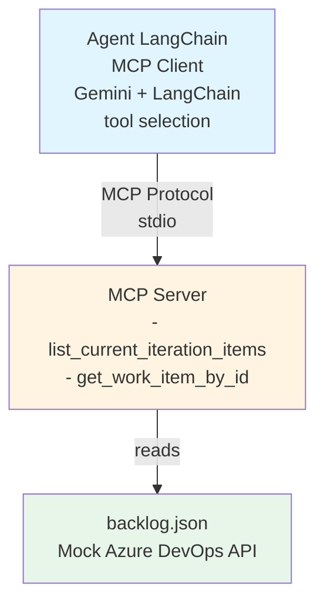
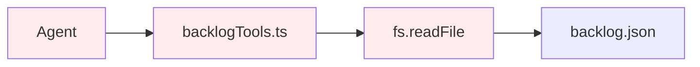
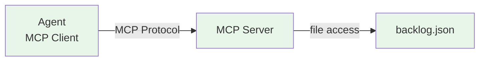

# Day 1 — Status & Implementation Guide

**Date:** December 29, 2025  
**Owner:** Juan Guzman  
**Status:** ⚠️ NEEDS ARCHITECTURAL CORRECTION

---

## ⚠️ CRITICAL ISSUE: Architecture Does Not Match Requirements

The current implementation was built with **incorrect architecture**:
- ❌ Agent directly accesses `backlog.json` file
- ❌ Backlog tools are in agent code, not MCP server
- ❌ Agent is not acting as MCP client

**Required architecture** (per challenge requirements):
- ✅ Agent should act as **MCP client**
- ✅ MCP server should expose **backlog tools**
- ✅ backlog.json is mock of **external Azure DevOps API**
- ✅ Agent should access data through **MCP protocol only**

**See**: [`ARCHITECTURE_CORRECTION_NEEDED.md`](./ARCHITECTURE_CORRECTION_NEEDED.md) for detailed correction steps

---

## Goal

Establish a working foundation with **proper MCP architecture**:
- **MCP Server** exposes backlog tools that read from `backlog.json` (mock Azure DevOps API)
- **Agent** acts as **MCP client**, connects to MCP server via stdio, calls MCP tools
- **Agent does NOT** directly access files or mock data

---

## Correct Architecture



### Current vs Required Architecture

#### ❌ Current (INCORRECT)

**Problem**: Agent directly accesses files, bypasses MCP abstraction layer

#### ✅ Required (CORRECT)

**Solution**: All external access goes through MCP server

---

## ✅ What Was Completed

### 1. Mock Backlog Data ✅
**File:** [data/backlog.json](../data/backlog.json)

Enhanced mock data with 5 diverse work items - **THIS IS CORRECT, no changes needed**:
- **ID 123**: UserStory - Password reset feature (with 2 children, 1 PR link)
- **ID 124**: Bug - UI freezes on login (High severity)
- **ID 125**: UserStory - Activity dashboard (with 3 children, 1 merged PR)
- **ID 126**: Task - API documentation update
- **ID 127**: Bug - Memory leak (Critical severity, with 2 children)

All items include:
- Iteration info (Sprint 25: Dec 15-29, 2025)
- Full fields: type, title, state, assignedTo, area, tags
- Acceptance criteria (where applicable)
- Child items with states
- PR links with status

### 2. Gemini API Integration ✅
**File:** [agent/src/agent.ts](../agent/src/agent.ts)

Configured LangChain with:
- Google GenAI integration using `@langchain/google-genai`
- Model: `gemini-2.5-flash` with temperature 0.1
- Tool-calling agent with proper prompt template
- Agent executor with verbose mode for debugging
- Environment variable configuration via `.env`

**Status**: THIS IS CORRECT, but needs MCP client connection

### 3. Informational Tools ✅ (But in wrong location)
**Files:** 
- [agent/src/tools/backlogTools.ts](../agent/src/tools/backlogTools.ts) ← **WRONG LOCATION**
- [agent/src/tools/index.ts](../agent/src/tools/index.ts)

Implemented two read-only tools:
1. **list_current_iteration_items**: Lists all items with owner and state
2. **get_work_item_by_id**: Retrieves detailed info including acceptance criteria, children, and PR links

**Issue**: These tools directly read from `backlog.json` - **violates MCP architecture**

### 4. Testing ✅
**File:** [agent/src/test-tools.ts](../agent/src/test-tools.ts)

Created comprehensive test suite that validates:
- ✅ Listing all items in current iteration
- ✅ Getting detailed info for work item 123 (with acceptance criteria and children)
- ✅ Getting work item 125 (multiple children)
- ✅ Handling non-existent work item (ID 999)

**Test Results:** All 4 tests passed successfully!

### 5. User Interface ✅
**File:** [agent/src/index.ts](../agent/src/index.ts)

Built interactive CLI interface with:
- Readline-based prompt for user queries
- Integration with agent executor
- Error handling and graceful shutdown
- Support for natural language queries

---

## 🔄 Required Changes for MCP Architecture

### Current Implementation (INCORRECT)
```typescript
// agent/src/tools/backlogTools.ts
export async function listCurrentIterationItems(): Promise<string> {
  const backlog = await loadBacklog();  // ❌ Direct file access
  // ... format and return
}
```

Agent directly reads `backlog.json` - **violates MCP architecture**.

### Required Implementation (CORRECT)
```typescript
// mcp/src/server/mcpServer.ts
case "list_current_iteration_items":
  // MCP server reads backlog.json
  const backlog = await loadBacklog();
  return {
    content: [{
      type: "text",
      text: JSON.stringify(backlog)
    }]
  };
```

```typescript
// agent/src/agent.ts
// Agent connects to MCP server, discovers tools, calls them via MCP protocol
const agent = await createAgent(); // Uses MCP client
```

---

## Tasks & Deliverables

### Must Have (🔄 In Progress)

#### 1. **Mock backlog data** ✅ (Already done)
   - File: `data/backlog.json`
   - Include: iteration info, items (UserStory/Task/Bug), fields, children, PR links

#### 2. **MCP Server: Add backlog tools** ❌ (Required)
   - File: `mcp/src/server/mcpServer.ts`
   - Add tool definitions:
     - `list_current_iteration_items`: Returns all items with owner, state, type
     - `get_work_item_by_id`: Returns detailed info for specific work item ID
   - Both tools read from `data/backlog.json`
   - Tools follow MCP protocol schema (inputSchema, proper responses)

#### 3. **Agent: Configure as MCP client** ❌ (Needs Refactoring)
   - **Remove**: Direct file access in `agent/src/tools/backlogTools.ts`
   - **Add**: MCP client connection via stdio to MCP server
   - **Configure**: LangChain to use MCP tools (discovered dynamically)
   - **Environment**: `.env` with `GEMINI_API_KEY`

#### 4. **Test MCP connection** ❌ (Required)
   - Verify agent discovers MCP tools on startup
   - Test: "List items in current iteration" → calls MCP tool
   - Test: "Show details for work item 123" → calls MCP tool
   - Verify: Agent never directly reads `backlog.json`

### Optional
- CLI interface for testing (can keep current one, but ensure it calls MCP tools)

---

## Checkpoints (move to Day 2 when all are true)

### ✅ Already Complete
- JSON mock data exists with realistic entries
- Gemini API configured in agent
- Basic CLI works
- Tool logic implemented (but in wrong location)

### ❌ Required Changes for MCP Architecture
- ❌ MCP server exposes `list_current_iteration_items` tool
- ❌ MCP server exposes `get_work_item_by_id` tool
- ❌ Agent connects to MCP server as client (stdio)
- ❌ Agent discovers MCP tools dynamically
- ❌ Agent calls MCP tools (not local functions)
- ❌ Agent does NOT directly access `backlog.json`
- ❌ Test: "List items" query calls MCP tool
- ❌ Test: "Get work item 123" query calls MCP tool

---

## Implementation Steps

### Step 1: Add Backlog Tools to MCP Server

**File**: `mcp/src/server/mcpServer.ts`

1. Import fs/path for reading `data/backlog.json`
2. Add tool definitions to `ListToolsRequestSchema` handler
3. Add tool implementations to `CallToolRequestSchema` handler
4. Handle errors (work item not found, file read errors)

### Step 2: Refactor Agent to Use MCP Client

**File**: `agent/src/agent.ts` and related files

1. Remove imports from `./tools/backlogTools.js`
2. Add MCP client connection (stdio transport to MCP server)
3. Configure LangChain to discover and use MCP tools
4. Remove direct file access code

### Step 3: Update Tool Definitions

**File**: `agent/src/tools/index.ts`

- Remove LangChain tool wrappers for backlog functions
- Tools should come from MCP server discovery

### Step 4: Test E2E

1. Start MCP server (or ensure it starts with agent)
2. Run agent CLI
3. Ask: "List items in current iteration"
4. Verify: Request goes through MCP protocol to MCP server
5. Ask: "Show details for work item 123"
6. Verify: MCP tool call returns expected data

---

## Why MCP Architecture Matters

1. **Security**: Agent cannot bypass abstraction layer to access sensitive data
2. **Modularity**: Adding tools to MCP server automatically makes them available to agent
3. **Scalability**: Later, MCP server can call real Azure DevOps API without changing agent
4. **Best Practice**: Follows Model Context Protocol standards

### Migration Path
- **Day 1**: MCP server reads backlog.json (mock)
- **Day 2**: Add RAG + KG to MCP server
- **Day 3**: Add write operations to MCP server
- **Future**: Replace backlog.json reads with real Azure DevOps API calls in MCP server

### Key Principle
> **Agent is a consumer, not a producer of data. All external data access must go through MCP server.**

---

## Files Created/Modified

### Created (Correct):
- ✅ `data/backlog.json` - Mock Azure DevOps data
- ✅ `agent/.env` - Environment configuration
- ✅ `agent/src/test-tools.ts` - Test suite

### Needs Refactoring:
- 🔄 `agent/src/tools/backlogTools.ts` - Should move to MCP server
- 🔄 `agent/src/agent.ts` - Needs MCP client connection
- 🔄 `agent/src/tools/index.ts` - Remove local tool definitions

### To Be Created:
- ❌ MCP backlog tools in `mcp/src/server/mcpServer.ts`

### Already Implemented (Keep):
- ✅ `agent/src/index.ts` - CLI interface
- ✅ `agent/package.json` - Dependencies

---

## Testing Instructions

Once MCP architecture is implemented:

1. **Start MCP server** (if separate process)
2. **Run the agent**
   ```bash
   cd agent
   npm run dev
   ```

3. **Test with natural language queries**
   - "List items in the current iteration with owner and state"
   - "Show acceptance criteria and linked tasks for work item 123"
   - "What bugs are in the current sprint?"
   - "Tell me about work item 125"

4. **Verify MCP protocol usage**
   - Check agent logs for MCP tool discovery
   - Verify no direct file reads in agent code
   - Confirm data flows through MCP server

---

## Day 2 Preview

Once Day 1 MCP architecture is working:
- Enhance MCP server with RAG (semantic search tool)
- Add Knowledge Graph to MCP server (relationship queries)
- Agent automatically discovers new MCP tools
- No changes needed to agent code (just MCP server enhancements)

---

## Summary

**What's Good**: We have working tool logic, Gemini integration, and mock data  
**What's Wrong**: Architecture violates MCP principles (direct file access)  
**What's Needed**: Move backlog tools to MCP server, configure agent as MCP client  
**Priority**: HIGH - Must fix before Day 2  

See [`ARCHITECTURE_CORRECTION_NEEDED.md`](./ARCHITECTURE_CORRECTION_NEEDED.md) for detailed implementation guide.
