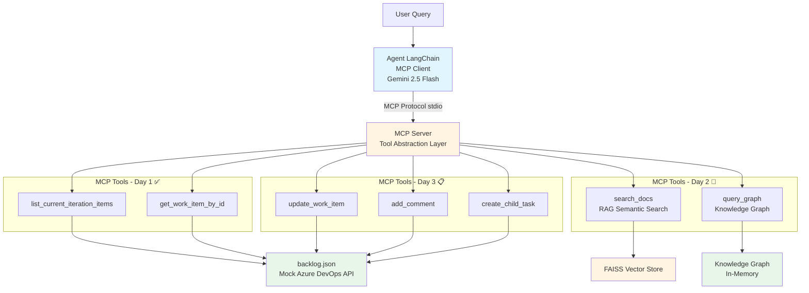

# Project Status - AI Agent with MCP Architecture

**Last Updated:** December 30, 2025  
**Current Phase:** Day 2 Implementation  
**Project:** Multi-Source Chatbot with Intelligent Agent Orchestration

---

## Quick Status

| Phase | Status | Date Completed |
|-------|--------|----------------|
| Day 1 - MCP Foundation | ✅ COMPLETE | Dec 29, 2025 |
| Day 2 - RAG + Knowledge Graph | 🚧 IN PROGRESS | Dec 30, 2025 |
| Day 3 - Write Operations | 📋 PLANNED | TBD |
| Day 4 - UI Integration | 📋 PLANNED | TBD |
| Day 5 - Validation | 📋 PLANNED | TBD |

---

## Architecture Overview



---

## Day 1 Summary (✅ Complete)

### What Was Built
1. **Mock Data Layer** - `data/backlog.json` with 5 realistic work items
2. **MCP Server** - Exposes backlog tools via MCP protocol
3. **Agent as MCP Client** - Connects to MCP server via stdio
4. **Gemini Integration** - LangChain + Gemini 2.5 Flash for tool selection
5. **End-to-End Tests** - All passing

### Architecture Highlights
- ✅ Agent never directly accesses data files
- ✅ All data access through MCP protocol
- ✅ Dynamic tool discovery (no hardcoding)
- ✅ Clean separation of concerns

### Current Capabilities
- List all items in current iteration
- Get detailed info for specific work item
- Filter and query backlog data
- Answer natural language questions about backlog

**Full Details:** [DAY_1_COMPLETE.md](DAY_1_COMPLETE.md)

---

## Day 2 Plan (🚧 In Progress)

### Goals
Enhance MCP server with:
1. **RAG (Retrieval Augmented Generation)** - Semantic search over work item content
2. **Knowledge Graph** - Structural queries about relationships

### What Will Be Added

#### RAG System
- **Tool:** `search_docs`
- **Purpose:** Semantic search over descriptions, acceptance criteria, comments
- **Tech Stack:** FAISS vector store, OpenAI/Google embeddings
- **Example:** "Find items related to authentication"

#### Knowledge Graph
- **Tool:** `query_graph`
- **Purpose:** Structural queries (parent-child, area, assignee, tags)
- **Implementation:** In-memory graph with nodes and edges
- **Examples:**
  - "What are the child tasks of US-123?"
  - "Show items assigned to John Doe"
  - "List items in Security area"

### Key Benefit
**Agent code unchanged!** New tools automatically discovered via MCP protocol.

**Full Details:** [DAY_2_PLAN.md](DAY_2_PLAN.md)

---

## Day 3+ Roadmap

### Day 3 - Write Operations
Add action tools to MCP server:
- `update_work_item` - Modify state, assignedTo, tags
- `add_comment` - Add comment to work item
- `create_child_task` - Create new subtask

### Day 4 - UI Integration
- Connect passive chat UI (LangChain Agent Chat UI or Express)
- Validate autonomous routing across all tools
- Real user testing

### Day 5 - Validation & Hardening
- Evaluate against challenge criteria
- Handle edge cases
- Performance optimization
- Documentation finalization

---

## Key Documents

### Planning
- [ACTION_PLAN.md](ACTION_PLAN.md) - Overall project plan
- [DAY_1_COMPLETE.md](DAY_1_COMPLETE.md) - Day 1 implementation report
- [DAY_2_PLAN.md](DAY_2_PLAN.md) - Day 2 detailed plan
- [ARCHITECTURE_CORRECTION_NEEDED.md](ARCHITECTURE_CORRECTION_NEEDED.md) - Architecture rationale
- [DOCUMENTATION_REVIEW_SUMMARY.md](DOCUMENTATION_REVIEW_SUMMARY.md) - Review findings

### Technical
- [docs/TECHNICAL_REQUIREMENTS.md](../docs/TECHNICAL_REQUIREMENTS.md) - Technical specs
- [docs/MCP_DEVELOPMENT_GUIDE.md](../docs/MCP_DEVELOPMENT_GUIDE.md) - MCP protocol guide
- [docs/BUILD.md](../docs/BUILD.md) - Build instructions

---

## Project Structure

```
laughing-memory/
├── agent/                    # Agent (MCP Client)
│   ├── src/
│   │   ├── agent.ts         # LangChain + Gemini configuration
│   │   ├── index.ts         # CLI interface
│   │   ├── utils/
│   │   │   ├── mcpClient.ts         # MCP client wrapper
│   │   │   └── modelInitializer.ts  # Gemini setup
│   │   └── test/
│   │       ├── test-gemini.ts       # Gemini API test
│   │       └── test-e2e.ts          # End-to-end test
│   └── package.json
│
├── mcp/                      # MCP Server
│   ├── src/
│   │   ├── extension.ts     # VS Code extension (future)
│   │   └── server/
│   │       ├── mcpServer.ts         # Main MCP server
│   │       ├── backlogHelper.ts     # Backlog data access ✅
│   │       ├── ragHelper.ts         # RAG implementation 🚧
│   │       └── graphHelper.ts       # Knowledge Graph 🚧
│   └── package.json
│
├── data/
│   └── backlog.json         # Mock Azure DevOps data ✅
│
└── plan/                    # Documentation
    ├── ACTION_PLAN.md
    ├── DAY_1_COMPLETE.md   # NEW - Merged day one docs
    ├── DAY_2_PLAN.md       # NEW - Day 2 detailed plan
    └── PROJECT_STATUS.md   # This file
```

---

## Technology Stack

### Agent
- **Framework:** LangChain (Node/TypeScript)
- **LLM:** Google Gemini 2.5 Flash
- **MCP Client:** Custom wrapper using stdio transport
- **Testing:** Node test runner

### MCP Server
- **Framework:** Node/TypeScript, MCP SDK
- **Tools:**
  - Backlog access (fs module)
  - RAG (FAISS, OpenAI/Google embeddings) - Day 2
  - Knowledge Graph (in-memory) - Day 2
- **Transport:** stdio (can upgrade to network later)

### Data
- **Current:** backlog.json (mock Azure DevOps)
- **Future:** Real Azure DevOps REST API

---

## Current Capabilities

### ✅ Working Now (Day 1)
- "List items in the current iteration"
- "Show details for work item 123"
- "What bugs are in the current sprint?"
- "Who is working on the password reset feature?"
- "What's the status of US-125?"

### 🚧 Coming Soon (Day 2)
- "Find items related to authentication" (RAG)
- "What are all child tasks of US-123?" (KG)
- "Show me items assigned to Jane Smith" (KG)
- "Search for API documentation tasks" (RAG)
- Complex queries combining multiple tools

### 📋 Planned (Day 3)
- "Mark US-123 as In Progress" (update)
- "Add comment 'Ready for QA' to US-123" (comment)
- "Create a subtask for US-123" (create)

---

## Testing Status

### Unit Tests
- ✅ Gemini API connection
- ✅ MCP server backlog tools
- 🚧 RAG system (pending)
- 🚧 Knowledge Graph (pending)

### Integration Tests
- ✅ Agent to MCP server connection
- ✅ Tool discovery via MCP protocol
- ✅ End-to-end query flow
- 🚧 Multi-tool queries (pending Day 2)

### E2E Tests
- ✅ List items query
- ✅ Get work item details
- ✅ Natural language filtering
- 🚧 Semantic search (pending Day 2)
- 🚧 Graph queries (pending Day 2)

---

## Next Steps

### Immediate (Day 2 Implementation)
1. Install RAG dependencies (FAISS, embeddings)
2. Create `ragHelper.ts` with FAISS integration
3. Add `search_docs` tool to MCP server
4. Create `graphHelper.ts` with in-memory graph
5. Add `query_graph` tool to MCP server
6. Test new tools independently
7. Test end-to-end with agent
8. Update documentation

### This Week
- Complete Day 2 (RAG + KG)
- Start Day 3 (write operations)
- Test complex multi-tool scenarios

### Next Week
- Complete Day 3 (write operations)
- Day 4 (UI integration)
- Day 5 (validation and hardening)

---

## Success Metrics

### Technical
- ✅ Agent never directly accesses files (enforced)
- ✅ All data access through MCP protocol (verified)
- ✅ Tools discovered dynamically (tested)
- 🚧 RAG provides relevant results (pending)
- 🚧 KG handles complex queries (pending)
- 📋 Write operations work correctly (planned)

### User Experience
- ✅ Natural language queries work
- ✅ Agent selects correct tools autonomously
- 🚧 Complex queries answered intelligently (pending)
- 📋 Actions performed correctly (planned)
- 📋 Error messages clear and helpful (ongoing)

### Architecture
- ✅ Modular design (verified)
- ✅ Clear separation of concerns (enforced)
- ✅ Scalable to real Azure DevOps API (designed for)
- ✅ Testable components (demonstrated)

---

## How to Run

### Run Agent CLI (Interactive)
```bash
cd agent
npm run dev
```

### Run Tests
```bash
# Gemini API test
cd agent
node dist/test/test-gemini.js

# End-to-end test
node dist/test/test-e2e.js

# MCP server tests
cd ../mcp
npm test
```

### Build
```bash
# Build everything
cd p:\github\laughing-memory
.\build\Build-Packages.ps1

# Build agent only
cd agent
npm run build

# Build MCP server only
cd mcp
npm run build
```

---

## Environment Setup

### Required Environment Variables
```bash
# agent/.env
GEMINI_API_KEY=your_gemini_api_key_here

# Day 2+ (optional - for OpenAI embeddings)
OPENAI_API_KEY=your_openai_key_here
```

### Getting API Keys
- **Gemini:** https://makersuite.google.com/app/apikey
- **OpenAI:** https://platform.openai.com/api-keys (optional - can use Google embeddings)

---

## Team Notes

### What's Working Well
- ✅ MCP architecture provides clean abstraction
- ✅ Dynamic tool discovery simplifies enhancements
- ✅ LangChain + Gemini integration smooth
- ✅ Test-driven approach catching issues early

### Challenges
- ⚠️ stdio transport debugging can be tricky
- ⚠️ MCP protocol learning curve initially
- ⚠️ Ensuring agent doesn't bypass MCP (requires discipline)

### Lessons Learned
- 💡 Start with MCP server tools first, then agent
- 💡 Create integration tests early
- 💡 Document tool schemas clearly
- 💡 Keep agent code simple - complexity in MCP server

---

## Questions & Decisions

### Resolved
- ✅ Use stdio transport for MCP (can upgrade later)
- ✅ Use Gemini 2.5 Flash for cost/speed balance
- ✅ In-memory Knowledge Graph sufficient for PoC
- ✅ FAISS for vector store (local, simple)

### Pending
- ❓ Use OpenAI or Google embeddings for RAG?
- ❓ How to handle large backlog (pagination)?
- ❓ When to migrate to real Azure DevOps API?

---

**Last Updated:** December 30, 2025  
**Updated By:** GitHub Copilot  
**Next Review:** End of Day 2
