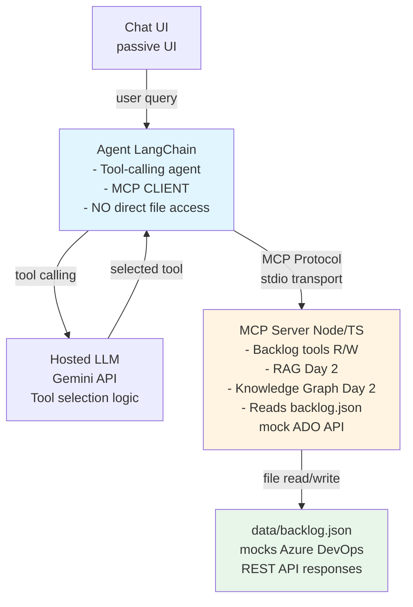

# PoC Action Plan — Multi-Source Chatbot with Intelligent Agent Orchestration (CORRECTED)

**Date:** December 29, 2025  
**Owner:** Juan Guzman  
**Context:** Internal assistant focused on Azure DevOps backlog. Hosted LLM = **Gemini API** (Google). External tool access = **MCP Server** (Node/TypeScript). Orchestration = **LangChain (Node/TS) as MCP Client**.

**CRITICAL ARCHITECTURE CORRECTION:**
- **Agent** acts as **MCP Client** - does NOT directly access files or external APIs
- **MCP Server** exposes all tools - reads/writes backlog.json (mock Azure DevOps API)
- **backlog.json** mocks external Azure DevOps REST API responses
- **Security**: Agent can only access external data/APIs through MCP protocol

---

## 1) Objectives
- Answer informational questions about user stories and backlog items in the **current iteration**.
- Perform **actions** on items (e.g., update fields, add comments, create child tasks) strictly through **MCP Server tools**.
- Ensure the agent **autonomously** chooses between tools — **no keyword routing or if/else**.
- Keep the architecture modular: adding tools to MCP server automatically makes them available to agent.
- **Enforce separation**: Agent never bypasses MCP to access files or APIs directly.

---

## 2) Scope (Phase 1 PoC)
- **Architecture**: Agent acts as MCP client, consuming tools from MCP server.
- **Day 1**: MCP server provides read-only backlog tools (list items, get details). Agent connects via stdio.
- **Day 2**: Enhance MCP server with RAG and Knowledge Graph capabilities for richer informational queries.
- **Day 3**: Add write operations to MCP server (update work item, add comment, create child task).
- **Data Flow**: Agent → MCP Protocol → MCP Server → backlog.json (mock) → Later: real Azure DevOps API.
- **UI**: Minimal chat UI (LangChain Agent Chat UI or Express endpoint) — passive, agent decides routes.

---

## 3) High-Level Architecture

**Notes**
- **Agent**: LangChain-based, uses Gemini for tool selection. Connects to MCP server via stdio as MCP client.
- **MCP Server**: Exposes ALL tools (backlog, RAG, KG, actions). Acts as secure abstraction layer.
- **backlog.json**: Mock data simulating Azure DevOps API responses. Only MCP server accesses this.
- **Security & Separation**: Agent never directly accesses files. All external data/actions go through MCP.
- **Day 1**: MCP server provides read-only backlog tools. Agent connects as MCP client.
- **Day 2**: Add RAG + KG capabilities to MCP server for enhanced queries.
- **Day 3**: Add write operations (update, create) to MCP server tools.

---

## 4) Components

### 4.1 Agent (LangChain, Node/TS)
- **Role**: MCP client that orchestrates tool calls via Gemini LLM
- **Connects to**: MCP server via stdio transport  
- **Does NOT**: Directly access files, databases, or external APIs
- **Tools available**: All tools exposed by MCP server (discovered dynamically via MCP protocol)
- **LLM**: Gemini via LangChain's Google GenAI integration with tool-calling
- **Dependencies**: LangChain, @langchain/google-genai, MCP client SDK (if needed for stdio)

### 4.2 MCP Server (Node/TS)
- **Role**: Secure abstraction layer for all external data and actions
- **Exposes tools**:
  - **Day 1 (Read-only)**: 
    - `list_current_iteration_items` — Returns all items with owner, state, type
    - `get_work_item_by_id` — Returns detailed info including acceptance criteria, children, PR links
  - **Day 2 (Enhanced informational)**:
    - `search_docs` — RAG semantic search over work item content
    - `query_graph` — Knowledge Graph queries for relationships
  - **Day 3 (Write operations)**:
    - `update_work_item` — Update state, tags, assigned to, etc.
    - `add_comment` — Add comment to work item
    - `create_child_task` — Create new child task under parent
- **Data source**: backlog.json (mock Azure DevOps API) → Later: real Azure DevOps REST API
- **Transport**: stdio (in-process for PoC, could be network later)
- **Location**: `mcp/src/server/mcpServer.ts`

### 4.3 backlog.json (Mock Data)
- **Purpose**: Simulates Azure DevOps REST API responses
- **Contains**: Current iteration items with full fields, children, links
- **Access**: Only through MCP server tools (NEVER directly by agent)
- **Future**: Replace with real Azure DevOps API calls in MCP server
- **Location**: `data/backlog.json`

### 4.4 RAG (Day 2)
- **Location**: Inside MCP server
- **Source**: Work item descriptions, acceptance criteria, comments from backlog.json
- **Store**: Local FAISS vector database
- **Exposed as**: MCP tool `search_docs`
- **Purpose**: Semantic search for informational queries

### 4.5 Knowledge Graph (Day 2)
- **Location**: Inside MCP server
- **Graph**: Relationships between user stories, tasks, bugs, PRs
- **Queries**: Parent/child relationships, dependencies, area, iteration
- **Exposed as**: MCP tool `query_graph`
- **Purpose**: Structural queries about work item relationships

### 4.6 UI
- LangChain Agent Chat UI or minimal Express endpoint
- Only forwards messages; does not decide which tool to use
- Agent autonomously selects appropriate MCP tools

---

## 5) Data & Configuration
- **Day 1 mock**: `data/backlog.json` containing current iteration items (UserStory/Task/Bug, fields, children, links).
- `.env` keys for **Gemini**:
  - `GEMINI_API_KEY` — for agent's LangChain-Gemini connection
- Later (Day 3): ADO PAT `ADO_PAT` for MCP server to call real Azure DevOps API

---

## 6) Timeline & Milestones

### Day 1 — MCP Foundation (Server + Client Connection)
**Goal**: Establish MCP server with backlog tools; agent as MCP client

**MCP Server tasks**:
- Add `list_current_iteration_items` tool to `mcp/src/server/mcpServer.ts`
- Add `get_work_item_by_id` tool to MCP server
- Both tools read from `data/backlog.json`
- Test tools via MCP protocol (stdio)

**Agent tasks**:
- Remove direct file access from `agent/src/tools/backlogTools.ts`
- Configure agent as MCP client (stdio transport to MCP server)
- Agent discovers MCP tools dynamically
- Agent calls MCP tools via protocol (no direct function calls)

**Checkpoint**: 
- ✅ Agent connects to MCP server via stdio
- ✅ Agent discovers MCP tools (`list_current_iteration_items`, `get_work_item_by_id`)
- ✅ Agent answers "List items in current iteration" by calling MCP tool
- ✅ Agent answers "Show details for ID X" by calling MCP tool
- ✅ Agent does NOT directly access backlog.json

### Day 2 — Enhanced Informational (RAG + KG in MCP Server)
**MCP Server tasks**:
- Add RAG capability:
  - Ingest backlog.json docs → build FAISS index
  - Expose `search_docs` MCP tool for semantic search
- Add Knowledge Graph:
  - Build in-memory graph from backlog relationships
  - Expose `query_graph` MCP tool for structural queries

**Agent tasks**:
- None (automatically discovers new MCP tools)

**Checkpoint**: 
- ✅ Agent answers complex queries using `search_docs` and `query_graph` MCP tools
- ✅ Gemini autonomously selects between list/get/search/query tools

### Day 3 — Write Operations via MCP Server
**MCP Server tasks**:
- Implement write operation tools:
  - `update_work_item` — Update state, tags, assigned to (modifies backlog.json)
  - `add_comment` — Add comment to work item (modifies backlog.json)
  - `create_child_task` — Create new child task (modifies backlog.json)
- Write operations modify backlog.json (mock) → Later: call real Azure DevOps API

**Agent tasks**:
- None (automatically discovers new write tools)

**Checkpoint**: 
- ✅ Agent autonomously triggers write operations when user requests actions
- ✅ Example: "Add comment 'Ready for QA' to US-123" calls MCP `add_comment` tool
- ✅ All writes go through MCP server, never directly from agent

### Day 4 — UI Integration & E2E
- Connect passive chat UI (LangChain Agent Chat UI or Express)
- Validate autonomous routing across all MCP tools
- **Checkpoint**: Real user prompts invoke correct MCP tools end-to-end

### Day 5 — Validation & Hardening
- Evaluate against challenge criteria (autonomy, separation, modularity, security)
- Handle edge cases (missing ID, MCP errors, empty results)
- **Checkpoint**: All criteria satisfied; MCP architecture validated

---

## 7) Acceptance Criteria
- **Agent acts as MCP client**: All data access and actions go through MCP protocol (NO direct file/API access)
- **MCP server as abstraction layer**: All external integrations (backlog.json, later Azure DevOps API) handled by MCP server
- **Tool discovery**: Agent dynamically discovers MCP tools (no hardcoding)
- **Informational queries**: Use MCP tools (`list_current_iteration_items`, `get_work_item_by_id`, `search_docs`, `query_graph`)
- **Action requests**: Execute via MCP server write tools (`update_work_item`, `add_comment`, `create_child_task`)
- **Agent autonomy**: LLM autonomously selects appropriate MCP tools; no if/else routing logic
- **Modularity**: Adding new tools to MCP server automatically makes them available to agent
- **Security**: Agent cannot bypass MCP server to access external resources
- **Error handling**: MCP tools return structured errors; agent handles gracefully

---

## 8) Testing Scenarios (examples)
- **"List current iteration items"** → Agent calls MCP `list_current_iteration_items` tool
- **"What are the acceptance criteria for US-123?"** → Agent calls MCP `get_work_item_by_id` tool
- **"Search for items about authentication"** → Agent calls MCP `search_docs` tool (Day 2)
- **"What are the child tasks of US-125?"** → Agent calls MCP `query_graph` tool (Day 2)
- **"Add comment 'Ready for QA' to US-123"** → Agent calls MCP `add_comment` tool (Day 3)
- **"Update US-123 state to 'In Progress'"** → Agent calls MCP `update_work_item` tool (Day 3)

---

## 9) Risks & Mitigations
- **MCP connection issues** → Implement retry logic, clear error messages
- **Hosted LLM cost/limits** → Use smaller model, cap tokens, cache results
- **Ambiguous queries** → Agent asks clarifying questions
- **Auth failures (later)** → Clear error messages and PAT scope guidance in MCP server
- **Data sparsity** → Seed mock docs and graph for demo quality
- **Agent trying to bypass MCP** → Code review, remove all direct file access from agent code

---

## 10) Deliverables
- `data/backlog.json` (mock ADO data)
- MCP Server with backlog tools (Day 1), RAG+KG (Day 2), write ops (Day 3)
- Agent as MCP client (reads tools from MCP server, no direct file access)
- Passive UI (Day 4)
- Documentation of MCP architecture and tool definitions
